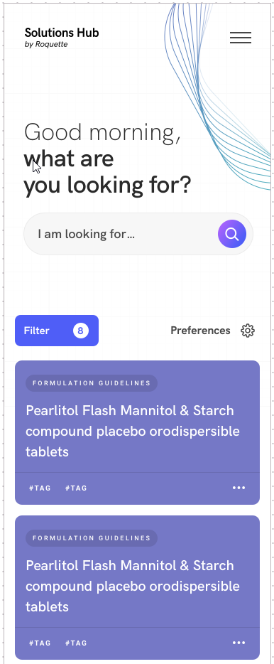

# Медиа выражения для разных устройств

---

## Какие медиа выражения мы поддерживаем?

Коротко - все. Начиная от 320 в ширину (iPhone 5) и заканчивая 4k экранами. 
Так как на 4к дизайны никто не делает, нужно убедиться, чтобы на них ничего не ломалось,
не забывая об "адекватности" отображения картинок.

---

## Поддерживаем ли мы Landscape режим для мобильных устройств?

Коротко - да. Однако, если для этого есть требования. В остальных случаях, мы не уделяем этому времени.

---

## Основной принцип - Mobile-first

Нет, это не значит, что если вы приступили к работе, то сначала необходимо создавать мобильную версию.
Это не только неудобно и вызывает когнитивный диссонанс, но и требует гораздо больше времени для разработки.
Что же здесь имеется в виду? После того как вы прописали стили для десктоп версии, пожалуйста, убедитесь, что вы не
забыли правильно расположить стили, которые будут меняться в медиа выражениях с приставкой min-width. Пример:

```scss
.header {
  display: block;
  
  @media (min-width: ${BIG_TABLET_WINDOW_WIDTH}px){
    font-family: "Agency FB";
  }
  
  @media (min-width: ${SMALL_DESKTOP_WINDOW_WIDTH}px){
    display: flex;
    align-items: center;
  }
}

```

- Для вёрстки от мобильных (mobile first) лучше использовать медиа выражения с min-width и 
располагать их в порядке увеличения ширины экрана; 
- Для вёрстки от десктопа (desktop first) — max-width, и располагать выражения в обратном порядке.

---

## Tablet designs

Как правило, дизайнеры не предоставляют дизайн для планшетных устройств. Однако, вы должны помнить, 
что Web - это не про медиа выражения, это про синергию взаимодействия элементов в пространстве.
Тренируйте чувство прекрасного, чтобы получить вменяемое отображение на любом устройстве.

Примеры:

**Desktop design:**


**Tablet design:**


**Mobile design:**



---

## Breakpoints

Зачастую, мы используем .scss или css-in-js переменные. Примеры:

```js
export const DESKTOP_WINDOW_WIDTH = 1440;
export const SMALL_DESKTOP_WINDOW_WIDTH = 1184;
export const BIG_TABLET_WINDOW_WIDTH = 992;
export const TABLET_WINDOW_WIDTH = 736;
export const BIG_MOBILE_WINDOW_WIDTH = 558;
export const MOBILE_WINDOW_WIDTH = 320;
```

```scss
$desktop-window-width: 1440px;
$small-desktop-window-width: 1184px;
$big-tablet-window-width: 992px;
$tablet-window-width: 736px;
$big-mobile-window-width: 558px;
$mobile-window-width: 320px;
```

Данные константы являются предпочтительным вариантом, но не окончательным. Естественно, они могут изменяться в зависимости
от дизайна текущего проекта. Также вы можете использовать миксины, 
если вам потребуется переопределять стили в случаях специфичных для проекта. Пример:

```scss
@mixin mobile-tiny {
  @media screen and (max-width: $mobile-window-width) {
    @content
  }
}
```

---

## Связанный Code style

Одно из главных правил хорошего разработчика - не плоди сущности без надобности. 
Старайтесь описывать поведение элемента в самом элементе. Держите логику в фокусе.
Не позволяйте ей размазываться по всему файлу.


